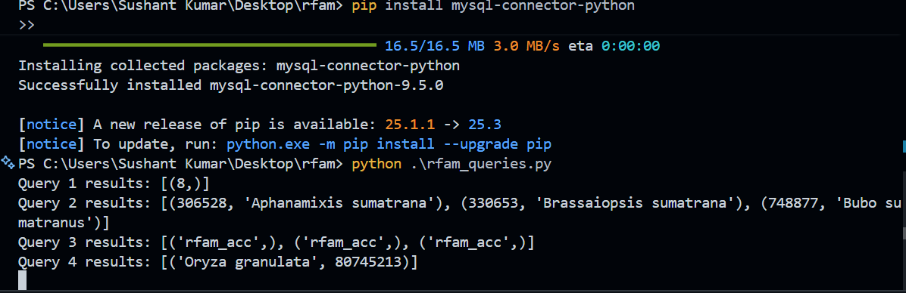

# Rfam MySQL Queries – Assignment Script

This repository contains a Python script (`rfam_queries.py`) that connects to the **public Rfam MySQL database** hosted by EMBL-EBI and executes a set of SQL queries to answer taxonomy and sequence-related questions.

---
## 🖼 Results Screenshot

Below is a screenshot showing the successful execution of the script and the query outputs fetched from the public Rfam MySQL database.




## 📌 Database Details

The script connects to the official **read-only Rfam MySQL server**:

- **Host:** `mysql-rfam-public.ebi.ac.uk`
- **Port:** `4497`
- **Username:** `rfamro`
- **Database:** `Rfam`
- **Access:** Read-only (no password required)

No local database setup is needed.

---

## 🛠 Requirements

- Python **3.8+**
- MySQL Connector for Python

Install the required package using:

```bash
pip install mysql-connector-python

▶️ How to Run the Script

Clone or download this repository.

Open a terminal or PowerShell in the project directory.

Run the script:

python rfam_queries.py

📊 Queries Executed

The script executes the following queries sequentially:

Q2a – Tiger Taxonomy

Counts the number of distinct tiger species in the taxonomy table.

Retrieves taxonomy information for the Sumatran tiger.

Q2b – Table Relationships

Identifies common key columns (rfam_acc, rfamseq_acc, ncbi_id) across tables using INFORMATION_SCHEMA.

Q2c – Rice DNA Sequences

Finds the rice species (Oryza) with the longest associated DNA sequence.

Q2d – Large Rfam Families

Counts Rfam families that have at least one DNA sequence longer than 1,000,000 bases.

📤 Output

Query results are printed directly to the console.

For large result sets, only the first three rows are displayed for readability.

Example output:

Query 1 results: [(8,)]
Query 2 results: [(45406, 'Panthera tigris sumatrae')]